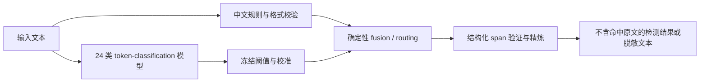

# pii-zh-qwen

面向简体中文的本地 PII 检测模型与级联服务。项目同时提供：

- 一个 24 类、49 个 BIO token 标签的 0.6B 中文 PII 模型候选；
- 一个可安装的 Presidio + 中文规则 + 模型级联服务；
- CLI、FastAPI、本地 Docker、训练与评测代码；
- 可重放的模型卡、对比实验、发布门禁与供应链证据。

> 当前版本：`0.2.0rc1` community research preview candidate。模型和本地服务候选已经完成
> machine-verifiable RC 验收，但尚未发布、不是生产版本。训练与主 Open-24 评测均为合成数据；
> 许可证人审和私密安全报告渠道仍未完成。本项目不声称“首个”“全局最强”“真实世界 SOTA”
> 或合规保证。

English summary: a local-first Simplified Chinese PII token classifier and Presidio/rules/model
cascade. This is a synthetic-data research candidate, not a production privacy control.

## 三分钟开始

### 1. 从源码安装

```bash
uv sync --frozen --extra cascade --extra service --extra dev
```

所有命令默认只访问本地文件；不会自动从 Hub 下载模型。

### 2. 先运行 rules-only 服务

```bash
uv run pii-zh detect --text '测试邮箱 demo@example.com' --pretty
uv run pii-zh redact --text '测试邮箱 demo@example.com' --replacement '<EMAIL>'
```

CLI 输出检测标签、字符起止位置、分数和来源，不回显命中的原始值。默认 profile 是历史兼容的
`c1-conservative-v1`；较严格的 `c1-conservative-v2` 需显式选择。

### 3. 加载本地模型并启用级联

```bash
export MODEL_DIR=/path/to/pii-zh-qwen3-0.6b-24class
export CALIBRATION_JSON=/path/to/frozen-calibration.json

uv run pii-zh detect \
  --profile community-model-cascade-v1 \
  --mode cascade \
  --model-path "$MODEL_DIR" \
  --calibration "$CALIBRATION_JSON" \
  --device cpu \
  --text '这是仅用于演示的合成文本。' \
  --pretty
```

只有同时使用发布记录绑定的模型、校准文件、service profile 和代码 revision，才是在重放已评测
的完整系统。只加载权重得到的是 `model_raw`，不能引用级联服务指标。

### 4. 启动本地 HTTP API

```bash
uv run pii-zh serve \
  --profile community-model-cascade-v1 \
  --mode cascade \
  --model-path "$MODEL_DIR" \
  --calibration "$CALIBRATION_JSON" \
  --host 127.0.0.1 \
  --port 8000
```

```bash
curl --fail --silent --show-error \
  -H 'content-type: application/json' \
  --data '{"text":"测试邮箱 demo@example.com"}' \
  http://127.0.0.1:8000/v1/analyze
```

默认绑定 loopback、关闭 access log，并设置请求体、文本长度、并发和超时上限。部署边界见
[级联部署文档](docs/cascade-deployment.md)和[服务接口文档](docs/community-model-service.md)。

## 为什么采用级联

中文 PII 不是单一 NER 问题：身份证、银行卡、车牌等结构化标识适合规则与校验器；姓名、地址和
上下文实体更依赖模型；Presidio 提供统一识别器接口和工程集成能力。当前服务按固定顺序执行：



这种架构允许高精度规则补充模型盲区，也允许通过来源、阈值和 profile 控制容易误伤的高召回规则。
架构细节见[级联设计](docs/cascade-architecture.md)。

## 评测结果：三组结果不能混用

### 1. 冻结 synthetic Open-24 发布轨道

主候选在具名、冻结、公开/合成 Open-24 协议上完成了 exact replay 和 10,000 次文档配对
bootstrap。这里的“领先”只限本表协议，不外推到真实业务。

| 轨道 | 系统 | strict micro F1 | strict recall | PII-free document FPR |
|---|---|---:|---:|---:|
| 单模型 | `pii-zh-qwen3-0.6b-24class` | 0.9867 | 0.9907 | 0.0000 |
| 单模型对照 | AIguard fast Open-24 | 0.2512 | 0.1862 | 0.1160 |
| 完整服务 | community model cascade | **0.9888** | 0.9781 | **0.0000** |
| 服务对照 | native Presidio + CLUENER + cn_common_v6 | 0.6237 | 0.5185 | 0.1622 |

完整服务相对对照的 Δmicro F1 为 `+0.3651`，95% CI `[0.3570, 0.3733]`；
Δdocument FPR 为 `-0.1622`，95% CI `[-0.1731, -0.1513]`。这些数字来自合成 Open-24，
不代表生产域、真实 PII 或人工隐藏集表现。完整限定与 hash 见
[技术指南](docs/aiguard24_full_model_and_cascade_technical_guide.md)和
[当前模型卡](model_cards/PII_ZH_QWEN3_0_6B_24CLASS_RC1.md)。

### 2. PII Bench ZH：公开测试已见、仅单模型 post-hoc

该次只评测 `model_raw`，没有运行当前完整级联；结果已暴露且不允许用于模型选择。`full_system`
必须写作 N/A，不能从其他轨道推断。

| suite | 文档数 | strict micro F1 | strict macro F1 | 当前完整服务 |
|---|---:|---:|---:|---|
| Formal | 5,000 | 0.5992 | 0.5799 | N/A（未评测） |
| Chat | 3,000 | 0.4763 | 0.4187 | N/A（未评测） |
| Pooled | 8,000 | 0.5575 | 0.5297 | N/A（未评测） |

同一公开 closed-8 benchmark 上，OpenMed QwenMed 600M 的历史 pooled raw micro F1 为 `0.6239`，
OpenMed Privacy Filter Multilingual v2 为 `0.6775`，已见 AIguard raw envelope 为 `0.7364`。
因此当前单模型不是该公开测试上的最佳模型；项目重点是可控的完整级联服务。不同 generation、
decoder、label coverage 和框架 hybrid 不能拼成一个无条件排行榜。详细审计见
[baseline matrix](docs/baseline_matrix.md)和[benchmark landscape](docs/benchmark_landscape.md)。

### 3. 第一版 CLUENER 服务兼容回归

历史第一版服务在公开 CLUENER dev 兼容门上的 `TP/FP/FN=2525/820/547`，F1 为
`5050/6417 = 0.786972`。非默认 legacy compatibility profile 的实际服务回放达到
`2510/736/562`，F1 为 `5020/6318 = 0.794555`，超过第一版。

这只关闭“新集成服务至少超过旧服务”的有限兼容门：阈值是在公开 dev 结果可见后设定，属于 post-hoc，
不代表当前 AIguard24 完整服务已在 CLUENER 上评测，也不激活生产或 SOTA 声明。

## 模型与数据

- 模型名称：`pii-zh-qwen3-0.6b-24class`
- Python 包版本：`pii-zh-qwen==0.2.0rc1`
- 初始化：`ZJUICSR/AIguard-pii-detection-fast` revision
  `677a5ebc1600fef61e8973cafd3026be322b3a73`
- 架构：Qwen3 token classification，padding-aware full bidirectional attention
- 参数：596,100,145 个 FP32 参数；权重约 2.22 GiB
- 输出：`O + 24×BIO = 49` 个 token 标签
- 本次训练/正式评测长度：512；模型配置上限不等同于已经验证的服务长度
- 训练：87,995 条，其中 39,600 条 PII-free
- 开发验证：2,005 条，其中 900 条 PII-free
- 数据性质：两个 split 均为 100% 确定性合成/开源派生数据，未使用客户或生产 PII

训练集与开发集存在 17 个 template-group overlap，开发结果不是独立真实数据泛化证据。公开测试也已
被读取，因此后续优化不能继续在同一测试集上反复选择模型或阈值。

24 个实体类型为：

`PERSON_NAME`, `PHONE_NUMBER`, `EMAIL_ADDRESS`, `ADDRESS`, `DATE_OF_BIRTH`,
`CN_RESIDENT_ID`, `PASSPORT_NUMBER`, `DRIVER_LICENSE_NUMBER`,
`SOCIAL_SECURITY_NUMBER`, `BANK_CARD_NUMBER`, `BANK_ACCOUNT_NUMBER`,
`VEHICLE_LICENSE_PLATE`, `EMPLOYEE_ID`, `STUDENT_ID`, `MEDICAL_RECORD_NUMBER`,
`WECHAT_ID`, `QQ_NUMBER`, `ALIPAY_ACCOUNT`, `USERNAME`, `IP_ADDRESS`, `MAC_ADDRESS`,
`DEVICE_ID`, `GEO_COORDINATE`, `SECRET`。

`SECRET` 是安全敏感信息类型，不一定属于法律意义上的个人信息。模型输出也不能直接替代法律、合规、
访问控制或人工复核。

## 当前本地 RC 证据

不可变 community-v2 本地回执状态为：

```text
status=READY_FOR_USER_AUTHORIZATION
local_candidate_complete=true
blocker_ids=[]
receipt_sha256=087b1c0e1b918e2c927c0653f312d8d0dc2954b6631b46fa22f9d7e194a84880
```

它绑定了模型包、wheel、wheelhouse、SBOM、依赖扫描、public artifact scan、容器以及五项固定
verification。它只证明本地候选证据闭合，不证明 GitHub/Hugging Face 已发布，也不等于生产批准。

源代码版本、分发 metadata 和 FastAPI/OpenAPI 版本现统一为 `0.2.0rc1`。公开发布还需要独立
publication successor 绑定 Git commit、签名 tag、GitHub Release、Hugging Face immutable commit
以及重新生成的发布态模型包。操作与阻塞清单见
[PUBLISHING.md](release/community-v2-rc1/PUBLISHING.md)。

## 开发与复验

```bash
uv sync --frozen --extra cascade --extra service --extra training --extra dev
uv run ruff check src tests scripts
uv run python -m scripts.run_current_community_rc_tests
uv build --wheel
```

current-RC runner 使用适合 GitHub 干净 checkout 的显式产品/发布测试 allowlist；它不会依赖未公开
的历史冻结件、逐行数据或本机证据树。当前公开源码闭包为 429 tests。更大的本地历史回执是冻结
候选证据，不代表当前 Git tree，也不替代这条 clean-checkout CI。所有正式验证均设置
`CUDA_VISIBLE_DEVICES=''`、`HF_HUB_OFFLINE=1` 和 `TRANSFORMERS_OFFLINE=1`，无需 GPU 或网络。

核心文档：

- [冻结本地模型卡](model_cards/PII_ZH_QWEN3_0_6B_24CLASS_RC1.md)
- [Hugging Face publication-successor 模型卡](model_cards/PII_ZH_QWEN3_0_6B_24CLASS_PUBLICATION.md)
- [完整模型与级联技术指南](docs/aiguard24_full_model_and_cascade_technical_guide.md)
- [社区发布门禁](docs/community-cascade-release-v2.md)
- [级联架构](docs/cascade-architecture.md)
- [部署说明](docs/cascade-deployment.md)
- [服务 API](docs/community-model-service.md)
- [发布说明](release/community-v2-rc1/RELEASE_NOTES.md)

## 仓库结构

```text
src/pii_zh/        运行时、模型、规则、Presidio、级联和服务
scripts/           训练、评测、发布 artifact 与验证 producer
configs/           taxonomy、训练、评测和发布 schema/config
tests/             current-RC 回归、打包和安全边界测试
docs/              架构、部署、评测与证据边界
model_cards/       当前模型卡与历史模型卡
release/           发布说明、检查清单和供应链模板
docker/            本地训练/推理镜像模板
```

模型权重、原始/记录级数据、训练运行目录、真实凭据和本地 `.env` 不进入 Git。

## 安全、隐私与许可证

- 只对你有权处理的文本运行 PII 检测；不要把真实 PII 提交到 issue、日志或公开复现。
- 本地 API 默认绑定 `127.0.0.1`；不要无保护地暴露到公网。
- 模型可能漏检或误检；脱敏前应结合场景阈值、人工抽检和回滚策略。
- 当前 [SECURITY.md](SECURITY.md) 仍明确记录：私密漏洞报告渠道尚未创建并实测，因此公开上传被阻塞。
- 代码仓库使用 Apache-2.0；模型与依赖的机械归属见
  [THIRD_PARTY_NOTICES.md](THIRD_PARTY_NOTICES.md)。最终 license report 仍为
  `COMPLETE_HUMAN_APPROVAL_PENDING`，不能解读为法律批准。
- 首次公开发布不应附带第三方 wheelhouse；只发布经人审批准且有明确再分发权的内容。

## 发布状态

本分支用于整理本地 release commit 与实际发布材料。本 README 不声称已经执行远端 push、tag、
GitHub Release 或 Hugging Face upload。发布时必须验证精确 commit/tag/revision 和各制品 SHA-256，
再由独立 publication receipt 双向绑定。

参见 [v0.2.0rc1 release notes](release/community-v2-rc1/RELEASE_NOTES.md) 与
[发布运行手册](release/community-v2-rc1/PUBLISHING.md)。

## License

Repository code is licensed under the [Apache License 2.0](LICENSE). Third-party model, dataset and
dependency terms apply independently; review them before redistribution or production use.
