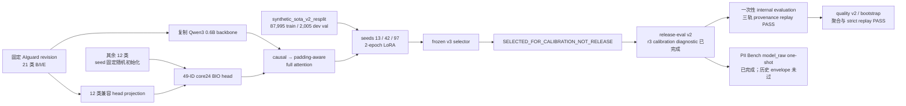
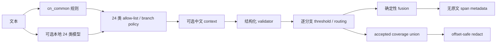

# AIguard24 full-attention 模型与中文 PII 级联服务技术说明

> 文档状态：当前冻结证据快照与发布填充规范。三 seed 训练、seed97 冻结选择、最终 r3 calibration
> 服务诊断、一次性 internal 三轨、PII Bench ZH `model_raw` one-shot 与 quality v2/bootstrap 聚合均已
> 完成；quality 聚合与 community-v2 strict replay 均为 `PASS`。生成式 Model Card 与本地模型包已经
> 产生，但候选仍处于本地发布准备、非生产状态。精确的本地候选 readiness 只由不可变
> community-v2 contract/receipt 表达；本文不预写其状态、不授权上传，也不替代 machine-readable
> manifest/receipt。当前模型卡见
> [`model_cards/PII_ZH_QWEN3_0_6B_24CLASS_RC1.md`](../model_cards/PII_ZH_QWEN3_0_6B_24CLASS_RC1.md)。

## 1. 当前结论与证据状态

截至 2026-07-18 当前可核验的 PII Bench ZH closed-8 历史 `model_only` 对照证据中：

- **在本文已闭合的历史对照集合内，历史系统 `ZJUICSR/AIguard-pii-detection-fast` 的
  `model_only` 轨在 Formal 和 Pooled strict micro F1
  最高**：Formal
  `0.80142013`、Chat `0.57135430`、Pooled `0.73639614`。权威聚合报告为
  [`reports/baselines/aiguard_pii_bench_zh.json`](../reports/baselines/aiguard_pii_bench_zh.json)。
- **同一历史对照集合内，Chat 单项最高的是历史系统 PII Engineer Chinese NER 的 `model_only`
  轨**：Formal `0.71834328`、Chat
  `0.70730994`、Pooled `0.71484809`。报告为
  [`reports/baselines/pii_engineer_chinese_ner_pii_bench_zh.json`](../reports/baselines/pii_engineer_chinese_ner_pii_bench_zh.json)。
- 因而不存在一个已闭合历史对照在 Formal、Chat 和 Pooled 三项同时全胜。这只是具名集合、固定
  closed-8 协议内的描述，不是全局排名。
- framework/service 是另一赛道。当前 Presidio 2.2.363 native + CLUENER + 中文规则的
  Formal/Chat/Pooled strict micro F1 为 `0.95273279 / 0.93613793 / 0.94736372`，但这是
  `framework_hybrid`，不能称为 CLUENER 或任何单模型的 F1。报告为
  [`reports/baselines/native_presidio_zh_ner_framework_hybrid_v2.json`](../reports/baselines/native_presidio_zh_ner_framework_hybrid_v2.json)。

这些历史结果和当前 seed97 的 posthoc 结果身份不同，不能把历史 `0.73639614` 归给当前候选。
PII Bench ZH 是公开、程序化合成且项目已查看的评测数据；它没有 PII-free 文档，不能证明
生产 FPR、完整 24 类能力或真实世界 SOTA。历史对照和 OpenMed Generation-2 结果见
[`baseline_matrix.md`](baseline_matrix.md)。

### full v3 冻结选择与当前门禁状态

当前冻结协议为 `aiguard24_synthetic_sota_v3_resplit_dev_selection`，固定 seeds `13/42/97`。三个 seed
均有 completed、self-hashed training manifest；冻结 selector 已选择 seed 97。下表 development 指标
从冻结 selection receipt 的 `ranking_metrics` 机械填入，不来自 final internal：

| seed | training status | validation risk score | validation strict micro F1 | manifest file SHA-256 |
|---:|---|---:|---:|---|
| 13 | `completed` | `0.9999999977103324` | `1` | `f62b63ae6e168003faaf4b65ec0ce38b37b348d3143db1fb05f0330491014734` |
| 42 | `completed` | `0.9999999982129333` | `1` | `0308dc700e8cdf83ed7f351f50c6d625e8a8686ade9e8007f89e2397a50785da` |
| 97 | `completed` | `0.9999999996893761` | `1` | `db9e16036fbcc9668e6f15be44fa3d02a060589c09d6609ee919d916940c6ed4` |

| selection status | selected seed | calibration status | final internal result status |
|---|---:|---|---|
| `SELECTED_FOR_CALIBRATION_NOT_RELEASE` | `97` | r3 服务 diagnostic 完成，非 release | 三轨一次性生成与 provenance strict replay PASS |

选择回执 file/self SHA-256 分别为
`c63dcada8436df855b492e373ee9525b12119648271e8bfb14010ec0540f6021` /
`dd770167e466aa423f7b90d0b7641e9141f38cf1e51156de1cb687b0cf08f029`。选中模型 training manifest
logical/file SHA-256 分别为
`fa19c6c352e9bbfc8c3ee7c0bec41077df1a44132da297f276d9caf4e4737751` /
`db9e16036fbcc9668e6f15be44fa3d02a060589c09d6609ee919d916940c6ed4`。development 指标来自冻结
selection receipt；quality 聚合与 strict replay 均已 `PASS`，本地候选的精确状态由独立 successor
community-v2 contract/receipt 表达。
PII Bench 已完成且结果如下文所示。本文不把 v3 候选列为全局最佳模型，也不声称
SOTA、“首个”或生产可用。

最终 calibration 服务 diagnostic 是 r3：同一 calibration split 上 `full_system` strict micro F1
`0.9862911266`，高于 `model_calibrated` 的 `0.9853252962`，两者 PII-free document FPR 均为 `0`。
r3 receipt self/file SHA-256 分别为
`5b60c28699787cc220de61c95986916e342675a83f75cc6cbf7ffab6684b703e` /
`b104f60fb6fccc6d45be68f7a97e37bb670ebd0e8cb3e7717bc7a76c1d199286`，状态固定为
`DEVELOPMENT_ONLY_DIAGNOSTIC_COMPLETE_NOT_RELEASE`。较早的 r2 **服务 diagnostic** 已 superseded；
它没有替换或撤销同一冻结 calibration bundle。

一次性 synthetic internal 中，quality v2 正式聚合覆盖的 strict micro F1 为：`model_raw`
`0.9866543562`、`full_system` `0.9887956375`。完整服务 precision/recall 为
`0.9997415575 / 0.9780868099`，PII-free document FPR 为 `0`。`model_calibrated` 产生了冻结预测，
但不属于 quality v2 的正式聚合轨，本文不补推其 precision/recall/macro/FPR。这些结果已被查看，因此模型、
calibration、规则、validator、路由、fusion 和服务配置全部不可回改；它们仍不是 public、human、
production 或发布结论。

## 2. 最终交付的组成

最终社区研究版分为两个互补产物：

1. **17 文件 Hugging Face 兼容模型包**：合并后的 `model.safetensors`、serialized fast tokenizer、
   49-ID BIO 配置、remote-code 模型实现、taxonomy/id2label、training manifest、生成式 Model Card、
   LICENSE/NOTICE/SECURITY/third-party notices、checksum 与本地 preauthorization 声明。
2. **外部内容寻址发布证据集**：selection/evaluation receipt、calibration binding、质量/性能重放、
   SBOM、license report、依赖扫描和模型包 manifest；这些文件不冒充模型包内部成员。
3. **本地级联服务代码与制品**：Presidio adapter、中文规则、context、结构化 validator、逐标签路由、
   确定性 fusion、offset-safe redact、Python API、CLI、HTTP API、wheel、container 和服务评测证据。

模型可以独立使用，但单模型质量不阻塞社区服务发布；完整服务必须通过 community quality gate。
生产 gate 仍独立 BLOCKED，community PASS 不能继承为 production-ready。

## 3. 模型设计



固定协议为
[`configs/train/aiguard24_sota_v3_resplit_selection.json`](../configs/train/aiguard24_sota_v3_resplit_selection.json)，
file SHA-256 为 `9f330eca4dbc6e522fc52b06f6bfb7c4047e455a0b3be555a94a03e6dd4ca51e`：

- source：AIguard revision `677a5ebc1600fef61e8973cafd3026be322b3a73`；
- attention：full；
- seeds：13、42、97；
- epochs：2；max length：512；
- train/eval batch：64/128；gradient accumulation：1；
- base/classifier LR：`2e-5 / 2e-4`；
- LoRA rank/alpha/dropout：`32 / 64 / 0.05`；
- checkpoint 主指标：validation `risk_weighted_score`；
- split isolation：`template-overlap-development-v1`；
- cross-seed 不设 raw development quality guardrail，依次最大化 risk-weighted score、strict micro F1、
  strict macro F1、PII-free precision，最后按 seed 升序打破平局；
- selector 输出只允许 `SELECTED_FOR_CALIBRATION_NOT_RELEASE`，校准或最终评测后不得重选；
- 公开 PII Bench 不得用于训练、validation、checkpoint/seed 选择或 threshold tuning。

该 v3 protocol 在 v3 训练前冻结；它记录了由前代 development validation 诊断推动的 resplit 设计，
但没有读取公开 benchmark 或 release-test 结果。协议文件中的 release-eval v1 字段是冻结时的历史
绑定；随后 supersession freeze 在任何 v3 seed42 validation result 之前撤销了 v1 confirmatory 身份。
冻结 selector 仍可只读验证 v1 manifest 以证明原协议未被回写，但不得读取 v1 JSONL，也不得把它用于
校准；实际 post-selection calibration 和 internal evaluation 必须改用 release-eval v2。

双向实现位于 [`src/pii_zh/models/qwen3_bi.py`](../src/pii_zh/models/qwen3_bi.py)。它构造
padding-aware 4-D additive mask，禁用 KV cache，只支持 eager/SDPA。AIguard 迁移实现位于
[`src/pii_zh/models/aiguard24.py`](../src/pii_zh/models/aiguard24.py)，会验证固定 source 文件哈希、
拒绝 pickle 权重，并生成不含本地路径的初始化审计。

## 4. 数据设计与可信度边界

冻结训练/开发集是 `pii_zh_synthetic_sota_v2_resplit` 2.0.0：87,995 train + 2,005 development
validation，24 类全部覆盖；PII-free 数分别为 39,600 和 900。文件与 manifest 绑定如下：

| artifact | SHA-256 |
|---|---|
| `train.jsonl` | `19ad4684923dc9d05e72efb50e1444a5f02c538c0107e388503f685ab5dab01b` |
| `validation.jsonl` | `cc0c248aeba4ae53048a9bd0bda4c19c751a5eb4eff59bb4a885e5b05bf0949f` |
| dataset manifest file | `3f0c348a29efa6e7c83d17261e589f1762151cca3898d78f3b5ed2a1553a8748` |
| dataset manifest logical | `a57f0719a9d225ee72a614e73e0b84f61be243e9fb4dfe6a56074015a8285186` |

该 resplit 是 validation-informed development 变更：它把原始 validation 的 7,995 条确定性提升到
train，保留 2,005 条 development validation。它显式允许 17 个 template group 跨 split 重叠，
因此不能再声称 template-family 隔离；`document_id`、`entity_value_group`、`source_group` 的跨 split
碰撞仍均为 0。其角色固定为 checkpoint/seed 选择与开发诊断，`release_test_eligible=false`。

可信度来自可审计的生成与隔离，而不是把合成数据描述成真实数据：

- 模板资产和人工 curation audit 被固定 hash；
- 实体值由确定性程序构造，不含真实 PII；
- 90,000 条正文全局唯一；
- train/validation 的文档 ID、实体值组和 source group 零碰撞；template group overlap 明确披露；
- 公开 benchmark、CLUENER、`chinese_common_ner` 和历史错误样本均未读取；
- 数据 manifest 只含聚合计数和 hash，不含原文或实体值。

原始生成配方的历史记录为 `docs/synthetic_sota_v1.md`（未纳入首发公开闭包），resplit 冻结配置见
[`configs/data/synthetic_sota_v2_resplit.yaml`](../configs/data/synthetic_sota_v2_resplit.yaml)。训练、开发和
release-eval 数据均为 100% 确定性合成；公开 PII Bench 只用于已见 posthoc 评测。这种证据足以支持
“可复现的合成数据 community candidate”，但不能替代真实语境、独立 human hidden、tenant/time
holdout 或生产 FPR。

### 4.1 post-selection release-eval v2

`pii_zh_synthetic_sota_release_eval_v2` 2.0.0 是独立 `evaluation_only` 数据：10,000 calibration +
10,000 internal evaluation，两个 split 各含 4,500 条 PII-free hard negative，并覆盖全部 24 类。

| artifact | SHA-256 |
|---|---|
| `calibration.jsonl` | `cb5cdfeff816f1338e26a471f1407246b9718bc60b059a70bb9d882e1fe97935` |
| `internal_evaluation.jsonl` | `43704ece40d733b1609093499a1d0b76ab7910ac1ba7ff60d7c3f2359ba6d4cf` |
| dataset manifest file / logical | `a09c9f502c2fef64a1db944150b45ab83179df01df8fa9f33a0c009b2a5faa42` / `bd99b9a858c07fe96f1effcc93d07defa17f7ce39a00712bcfe6b9fda56c19ad` |
| supersession receipt file / logical | `e3ba0a965bdfcf05aad53a0bdf79868f4b8bb9b0adf4d414d840e68d89904c58` / `342bf8672e211a6dd08078d7d12fd00551ec54710a6d6e921d178039f62110c4` |

v1 曾在 cross-seed 选择前被结构性查看一条 calibration 记录；正文已脱敏且没有模型预测或指标，
但严格协议仍将 v1 confirmatory 身份标记为 withdrawn。v1 现在只参与 v2 碰撞隔离，不能用于新的
calibration 或 final evaluation。v2 freeze 在任何 v3 seed42 validation result 前完成；calibration
只能在三 seed selection receipt 后读取，internal evaluation 只能在模型、服务和全部 calibration
工件冻结后运行一次。完整边界与重放证据保留在内部历史文档
`docs/synthetic_sota_release_eval_v2.md`；首发公开文档只陈述其聚合结论和哈希。

## 5. 级联服务设计



三种运行模式：

| mode | 规则 | 模型 | 语义 |
|---|---:|---:|---|
| `rules-only` | 开 | 关 | CPU/offline 基线；默认不加载 Torch/Transformers |
| `model-only` | 关 | 开 | 服务消融；仍经过 route、threshold 和 validator |
| `cascade` | 开 | 开 | 项目完整服务 |

`model-only` 不是纯 `model_raw`。纯模型指标必须由固定 checkpoint/tokenizer/decoder 的统一 evaluator
产出；服务 CLI 的 `model-only` 仍执行部分服务策略。发布报告必须至少分开 `model_raw`、
`rules_only`、`framework_hybrid` 和 `full_system`。

所有适配层共享一个 `CascadePipeline`，不会分别复制检测逻辑。运行时拒绝未知标签、关闭分支、非法
offset、NaN/越界 score 和不合约的 validator/context 输出；任一组件失败时 fail closed，不会在同一
请求中静默从 cascade 降级到 rules-only。架构不变量见
[`cascade-architecture.md`](cascade-architecture.md)。

## 6. 安装和离线运行

以下命令只使用调用方显式设置的可移植根目录，不把任何开发机用户名、共享盘编号或物理 GPU 编号写入
公开文档：

```bash
: "${REPO_ROOT:?set REPO_ROOT to the repository root}"
: "${MODEL_ROOT:?set MODEL_ROOT to the model-storage root}"
: "${DATA_ROOT:?set DATA_ROOT to the dataset-storage root}"
: "${RUN_ROOT:?set RUN_ROOT to the run-artifact root}"
```

### 本地源码安装

```bash
cd "$REPO_ROOT"
python -m pip install ".[cascade,service]"
```

纯 rules-only 可只安装基础包；模型推理至少需要 `[inference]`。CLI 和服务不会把仓库 ID、URL 或
请求参数转换为下载行为，模型模式只接受已存在的本地目录。

### 纯模型 API

```python
import os
from pathlib import Path

from pii_zh.inference import load_local_predictor

model_path = (
    Path(os.environ["MODEL_ROOT"]) / "pii-detect-model/releases/verified-model"
).resolve(strict=True)
predictor = load_local_predictor(
    model_path,
    device="cpu",
    micro_batch_size=8,
)
spans = predictor.predict("测试邮箱 demo@example.com")
```

加载器固定 `local_files_only=True`、`trust_remote_code=False`、`use_safetensors=True`，并验证完成态
training manifest 与全部模型文件 hash。

### 级联 Python/CLI

```python
import os
from pathlib import Path

from pii_zh.cascade import build_community_model_service_pipeline

model_path = (
    Path(os.environ["MODEL_ROOT"]) / "pii-detect-model/releases/verified-model"
).resolve(strict=True)
calibration_path = (
    Path(os.environ["RUN_ROOT"]) / "pii-detect-model/releases/calibration.json"
).resolve(strict=True)
pipeline = build_community_model_service_pipeline(
    model_path,
    mode="cascade",
    device="cpu",
    calibration=calibration_path,
)
detections = pipeline.detect("测试邮箱 demo@example.com")
redacted = pipeline.redact("测试邮箱 demo@example.com")
```

```bash
pii-zh detect \
  --profile community-model-cascade-v1 \
  --mode cascade \
  --model-path "$MODEL_ROOT/pii-detect-model/releases/verified-model" \
  --calibration "$RUN_ROOT/pii-detect-model/releases/calibration.json" \
  --text '测试邮箱 demo@example.com'
```

### Presidio `AnalyzerEngine`

Presidio adapter 接收上面同一个 pipeline，因此 Python、CLI、HTTP 与 Presidio 不会各自维护一套
规则、validator 或 fusion：

```python
import os
from pathlib import Path

from pii_zh.cascade import build_community_model_service_pipeline
from pii_zh.presidio import create_analyzer_engine

model_path = (
    Path(os.environ["MODEL_ROOT"]) / "pii-detect-model/releases/verified-model"
).resolve(strict=True)
calibration_path = (
    Path(os.environ["RUN_ROOT"]) / "pii-detect-model/releases/calibration.json"
).resolve(strict=True)
pipeline = build_community_model_service_pipeline(
    model_path,
    mode="cascade",
    device="cpu",
    calibration=calibration_path,
)
analyzer = create_analyzer_engine(cascade_pipeline=pipeline)
results = analyzer.analyze(text="测试邮箱 demo@example.com", language="zh")
```

安装时使用 `.[cascade,presidio]`；Presidio 返回 `RecognizerResult`，其完整级联质量归到
`full_system`，不能归因给 checkpoint 或 Presidio 框架本身。

### 本地 HTTP

```python
# deploy_local.py
import os
from pathlib import Path

from pii_zh.cascade import COMMUNITY_MODEL_SERVICE_PROFILE_VERSION
from pii_zh.service import create_app

model_path = (
    Path(os.environ["MODEL_ROOT"]) / "pii-detect-model/releases/verified-model"
).resolve(strict=True)
calibration_path = (
    Path(os.environ["RUN_ROOT"]) / "pii-detect-model/releases/calibration.json"
).resolve(strict=True)
app = create_app(
    profile_version=COMMUNITY_MODEL_SERVICE_PROFILE_VERSION,
    mode="cascade",
    model_path=model_path,
    device="cpu",
    calibration=calibration_path,
    max_concurrency=4,
)
```

```bash
uvicorn deploy_local:app --host 127.0.0.1 --port 8000 --workers 1 --no-access-log
curl --fail-with-body http://127.0.0.1:8000/healthz
curl --fail-with-body \
  -H 'content-type: application/json' \
  -d '{"text":"测试邮箱 demo@example.com"}' \
  http://127.0.0.1:8000/v1/analyze
```

服务默认不记录正文并返回 `Cache-Control: no-store`，但代理、APM、shell history 和调用方仍可能记录
敏感数据。不要把正文放入 URL，不要把服务直接暴露到公网。部署限制见
[`cascade-deployment.md`](cascade-deployment.md)。

## 7. 从零复现模型

当前选中候选的训练目录仍保留在本机，并已复制为一个 17 文件、内容寻址的本地 community-v2
模型包；两者都尚未上传：

```text
$RUN_ROOT/pii-detect-model/candidates/synthetic_sota_v2_resplit/
  qwen3_0_6b_aiguard24_bio_full_lora_seed97_v3/

$RUN_ROOT/pii-detect-model/release_eval_v2_seed97/community-v2-rc1-20260718/
  model-package-v2r2/
```

该路径只是本地定位信息；可移植身份必须使用上文 training manifest、权重和 selection receipt 的
内容哈希。模型包清单状态为 `PASS`，artifact SHA-256 为
`5ec6ae443c834f37131cf4a7f7d3afb09fc11613387b3abe3dffc1cf64a47117`。训练 manifest 的
`release_eligible=false` 未被改写；模型包仍是 `unpublished_local_candidate`，不能把本地目录当作
Hugging Face revision 或发布授权。

### 7.1 准备固定 source

优先复用已经存在的只读 source：

```text
$MODEL_ROOT/pii-detect-model/baselines/ZJUICSR/AIguard-pii-detection-fast
```

若确实缺失，先检查磁盘，再通过大陆 HF endpoint 下载到 `$MODEL_ROOT`；不要下载到仓库或用户主目录：

```bash
HF_ENDPOINT=https://hf-mirror.com \
hf download ZJUICSR/AIguard-pii-detection-fast \
  --revision 677a5ebc1600fef61e8973cafd3026be322b3a73 \
  --local-dir "$MODEL_ROOT/pii-detect-model/baselines/ZJUICSR/AIguard-pii-detection-fast"
```

初始化器随后会逐文件验证固定 hash，因此“同名目录”不等于合格 source。

### 7.2 重放冻结的 training/development resplit

```bash
python scripts/materialize_synthetic_sota_v2_resplit.py \
  --config configs/data/synthetic_sota_v2_resplit.yaml \
  --source-dir "$DATA_ROOT/pii-detect-model/processed/public_release_pool/synthetic_sota_v1" \
  --output-dir "${FRESH_V2_RESPLIT_REPLAY_DIR:?set FRESH_V2_RESPLIT_REPLAY_DIR}"
```

正式冻结目录已经存在且物化器拒绝覆盖：

```text
$DATA_ROOT/pii-detect-model/processed/public_release_pool/synthetic_sota_v2_resplit/
```

fresh replay 必须逐字节复现 train、validation 和 manifest 的上述 SHA-256；不要把 replay 目录写入
候选 training manifest。release-eval v2 的正式目录可用 metadata-first 验证器复核：

```bash
python scripts/validate_synthetic_sota_release_eval_v2.py \
  --dataset-dir "$DATA_ROOT/pii-detect-model/processed/public_release_pool/synthetic_sota_release_eval_v2"
```

验证器不会打印 JSONL 行；v2 已冻结时不要再次运行默认 materializer 覆盖正式目录。

### 7.3 顺序训练三个 seed

每次训练前先只读检查 GPU。只用一张当前空闲卡，不得 kill、暂停、reset 或抢占其他进程：

```bash
nvidia-smi \
  --query-gpu=index,name,memory.total,memory.used,memory.free,utilization.gpu \
  --format=csv,noheader
```

对 13、42、97 分别顺序运行；`FREE_GPU_ID` 每次都重新确认：

```bash
CUDA_VISIBLE_DEVICES="${FREE_GPU_ID:?set FREE_GPU_ID}" \
HF_HUB_OFFLINE=1 \
TRANSFORMERS_OFFLINE=1 \
TOKENIZERS_PARALLELISM=false \
python scripts/train_aiguard24_sota.py \
  --source-model "$MODEL_ROOT/pii-detect-model/baselines/ZJUICSR/AIguard-pii-detection-fast" \
  --train "$DATA_ROOT/pii-detect-model/processed/public_release_pool/synthetic_sota_v2_resplit/train.jsonl" \
  --validation "$DATA_ROOT/pii-detect-model/processed/public_release_pool/synthetic_sota_v2_resplit/validation.jsonl" \
  --output "$RUN_ROOT/pii-detect-model/candidates/synthetic_sota_v2_resplit/qwen3_0_6b_aiguard24_bio_full_lora_seed${SEED:?set SEED}_v3" \
  --attention-mode full \
  --seed "${SEED:?set SEED}" \
  --epochs 2 \
  --max-length 512 \
  --batch-size 64 \
  --eval-batch-size 128 \
  --gradient-accumulation 1 \
  --learning-rate 2e-5 \
  --classifier-learning-rate 2e-4 \
  --weight-decay 0.01 \
  --warmup-ratio 0.05 \
  --lora-rank 32 \
  --lora-alpha 64 \
  --lora-dropout 0.05 \
  --min-pii-free-ratio 0.40 \
  --split-isolation-policy template-overlap-development-v1 \
  --device cuda:0
```

训练脚本输出 LoRA-merged 单一 safetensors、最终 validation metrics 和 self-hashed manifest；每个
candidate 的 training manifest 都保留 `release_eligible=false`，不在看过结果后回写。本地候选完成
状态由独立 successor community-v2 contract/receipt 表达，也不等同于发布授权。

### 7.4 development-validation-only cross-seed 选择

```bash
python scripts/select_aiguard24_sota_v3_candidate.py \
  --protocol configs/train/aiguard24_sota_v3_resplit_selection.json \
  --dataset-manifest "$DATA_ROOT/pii-detect-model/processed/public_release_pool/synthetic_sota_v2_resplit/dataset_manifest.json" \
  --release-evaluation-manifest "$DATA_ROOT/pii-detect-model/processed/public_release_pool/synthetic_sota_release_eval_v1/dataset_manifest.json" \
  --candidate "$RUN_ROOT/pii-detect-model/candidates/synthetic_sota_v2_resplit/qwen3_0_6b_aiguard24_bio_full_lora_seed13_v3" \
  --candidate "$RUN_ROOT/pii-detect-model/candidates/synthetic_sota_v2_resplit/qwen3_0_6b_aiguard24_bio_full_lora_seed42_v3" \
  --candidate "$RUN_ROOT/pii-detect-model/candidates/synthetic_sota_v2_resplit/qwen3_0_6b_aiguard24_bio_full_lora_seed97_v3" \
  --output "$RUN_ROOT/pii-detect-model/candidates/synthetic_sota_v2_resplit/aiguard24_v3_selection.json"
```

不要使用历史 selector。v3 selector 要求三个 seed、recipe、source、label schema、数据 hash 和
完成态 artifact 全部匹配；选择只读取 development validation，不读取 PII Bench。

`--release-evaluation-manifest` 指向 v1 是冻结 v3 protocol/selector 的**历史 metadata binding**，不是
允许读取 v1 JSONL。supersession freeze 明确要求 selector 不回写，故此处只校验 v1 manifest；生成
selection receipt 后，实际 calibration 必须与 v2 manifest 和 supersession freeze 联合绑定。v1
JSONL 继续保持 withdrawn，不能生成 prediction、calibration 或 final metric。

### 7.5 选模后校准（仅 release-eval v2）

先通过 release-eval v2 stage gate 生成 calibration authorization，再用正式 prediction generator
以 selected checkpoint、未校准 score、threshold `0.0` 和完整 core24 scope 生成
`RAW_CORE24_CALIBRATION_PREDICTIONS_JSONL`；prediction 文件必须覆盖 v2 calibration 的同一文档
集合，且不得包含正文。prediction provenance 必须严格重放后才能拟合 calibration。完整的先开门、
生成、来源证明和 internal 解锁参数分别见
[`release_eval_v2_stage_gate.md`](release_eval_v2_stage_gate.md) 与内部历史文档
`docs/release_eval_v2_prediction_provenance.md`。随后运行：

```bash
python scripts/calibrate_predictions.py \
  --gold "$DATA_ROOT/pii-detect-model/processed/public_release_pool/synthetic_sota_release_eval_v2/calibration.jsonl" \
  --predictions "${RAW_CORE24_CALIBRATION_PREDICTIONS_JSONL:?set RAW_CORE24_CALIBRATION_PREDICTIONS_JSONL}" \
  --fit-prediction-manifest "${RAW_CORE24_CALIBRATION_PROVENANCE_JSON:?set RAW_CORE24_CALIBRATION_PROVENANCE_JSON}" \
  --release-eval-v2-authorization "${CALIBRATION_AUTHORIZATION_JSON:?set CALIBRATION_AUTHORIZATION_JSON}" \
  --output "${FRESH_CALIBRATION_BUNDLE_JSON:?set FRESH_CALIBRATION_BUNDLE_JSON}" \
  --diagnostics "${FRESH_CALIBRATION_DIAGNOSTICS_JSON:?set FRESH_CALIBRATION_DIAGNOSTICS_JSON}" \
  --model-version fa19c6c352e9bbfc8c3ee7c0bec41077df1a44132da297f276d9caf4e4737751 \
  --dataset-manifest "$DATA_ROOT/pii-detect-model/processed/public_release_pool/synthetic_sota_release_eval_v2/dataset_manifest.json" \
  --expected-dataset-manifest-sha256 bd99b9a858c07fe96f1effcc93d07defa17f7ce39a00712bcfe6b9fda56c19ad \
  --supersession-freeze configs/evaluation/synthetic_sota_release_eval_v2_supersession_freeze.json \
  --expected-supersession-freeze-sha256 06ebdce5e288b0e7699a8225e28c4c4f0a1762e76f6967cf990b14384101f0f0 \
  --t0-recall-floor 0.90 \
  --t1-recall-floor 0.80 \
  --fit-temperature
```

校准器会显式拒绝 v1、manifest/receipt/hash/record-role 不一致及已有输出。此步骤不允许重选 seed，
也不能把 calibration split 的指标写成最终指标。T1 floor `0.80` 是 calibration 阶段对候选可达到
召回上界的开发调整；此前 `0.85` 尝试因 `DEVICE_ID` 最大候选召回约为 `0.815445` 而不可达，模型、
checkpoint 和 seed 没有因此重选。bundle/diagnostics 的最终 Model Card 字段仍由生成器机械填充；
当前已核验状态如下：

| calibration status | bundle file SHA-256 | diagnostics manifest SHA-256 | r3 service diagnostic receipt self / file SHA-256 |
|---|---|---|---|
| frozen；r3 diagnostic `DEVELOPMENT_ONLY_DIAGNOSTIC_COMPLETE_NOT_RELEASE` | `789034b368289c8bee21e7bd3ebfd902bb667cd9fccb2bac109b4fb6778a53bc` | `cf36b6def95e808b4544b658276fd28ac667ce0d19ebaa821dd160f0d5d04753` | `5b60c28699787cc220de61c95986916e342675a83f75cc6cbf7ffab6684b703e` / `b104f60fb6fccc6d45be68f7a97e37bb670ebd0e8cb3e7717bc7a76c1d199286` |

| calibration diagnostic track | strict micro F1 | PII-free document FPR |
|---|---:|---:|
| `model_calibrated` | `0.9853252962` | `0` |
| `full_system` | `0.9862911266` | `0` |

这张表是 development-only calibration 诊断，不是 final quality。r3 沿用同一冻结 calibration bundle；
较早的 r2 只作为被 supersede 的服务 diagnostic 留存。

## 8. 评测与结果归因

### 8.1 release-eval v2 一次性 internal evaluation

只有 selected model、calibration bundle、完整服务配置、路由、validator、fusion 和 prediction producer
全部冻结后，才可读取 v2 `internal_evaluation`。当前一次性读取已完成；结果不能用于回改同一候选、
阈值或服务配置：

| track | run status | strict precision | strict recall | strict micro F1 | strict macro F1 | PII-free document FPR | final quality/result receipt SHA-256 |
|---|---|---:|---:|---:|---:|---:|---|
| `model_raw` | provenance strict replay PASS；quality aggregate PASS | `0.9826130569` | `0.9907290350` | `0.9866543562` | `0.9836583667` | `0` | `b3b046cee2278b93dc5f6c414a92defb2dda2ca699876ab1ec3774e87e26d8e2` |
| `model_calibrated` | prediction provenance PASS；不属于 quality v2 正式聚合轨 | N/A | N/A | N/A | N/A | N/A | N/A |
| `full_system` | provenance strict replay PASS；quality aggregate PASS | `0.9997415575` | `0.9780868099` | `0.9887956375` | `0.9834095040` | `0` | `b3b046cee2278b93dc5f6c414a92defb2dda2ca699876ab1ec3774e87e26d8e2` |

已产生的 binding/provenance 身份如下；file SHA-256 与 manifest 自哈希不可混写：

| artifact | logical/self SHA-256 | file SHA-256 |
|---|---|---|
| `internal.unlock.json` | `26db99d8ed6d0036e424ab212292081dd3931473e163303fa8314beca27e332b` | `02376544919d7a457abe537b9675301124aebceccdabd0210a78525e8e673406` |
| `final-model-binding.v2.json` | `e41bd27f09cca256a94da926a3fe884d27fd037d1d3050780288ed9d92153b11` | `0d4712aa5c54c25cf53c1b02f87c90ae6c442e7cd90da48a9af6b1bba2c19935` |
| `service-configuration-binding.v2.json` | `75bdddf262781128c0097107e0aef820a0f832262d9f10abd53ab41d901c576a` | `5d4ddcd7325f1a173e68d9e50e210efd04242ef8c69aa31dbd76a66b92e5c893` |
| `internal.model_raw.provenance.json` | `16da6074f01d056d18bbf284686ef1ccd99e556012a95168f98fe2b1f90eae85` | `c3c36c3e4edfbd18e45e27c776b5a9bcd8d3bffd77af2d3230a6f3613cc9b31b` |
| `internal.model_calibrated.provenance.json` | `45505b1cc35e4efe1804cbb2cd78e9479c209c7e2c1fd007b5c0458eb7a05d5b` | `fa68b1a2099e9e419d996ce4bcf84f5e5242b26edd0c07789fa4ddbbb9532ff4` |
| `internal.full_system.provenance.json` | `e450c195b8ef7a52b065ffa10e053cb40dbb85be401ca9221c86db1b0b92673e` | `a0bc8a7b4864275de8dbe760546966acb39a9a00cd82d52a012d41b8c36a7def` |

同一 quality aggregate receipt 的 file SHA-256 为
`581b509ed0139dd2ab36f4abd3d17046325b7e444b2f2999eb1959309cd24fc4`。它只正式聚合
`model_raw` 和 `full_system`。`model_calibrated` 的 prediction provenance self SHA-256 为
`45505b1cc35e4efe1804cbb2cd78e9479c209c7e2c1fd007b5c0458eb7a05d5b`，但 provenance 不能替代
聚合指标回执，因此该行不从 micro F1、development validation、calibration 或 PII Bench 推导其他
指标。上面的 internal 是 synthetic 内部证据，不是 human/production claim。

### 8.2 冻结公开描述性评测

在 cross-seed selection 和 v2 calibration 工件冻结之后、读取 PII Bench gold 之前已生成 freeze plan，
随后完成了当前候选唯一一次 `model_raw` 评测。结果如下：

| suite | documents | strict precision | strict recall | strict micro F1 | strict macro F1 |
|---|---:|---:|---:|---:|---:|
| Formal | 5,000 | `0.54933475` | `0.65904738` | `0.59921050` | `0.57994984` |
| Chat | 3,000 | `0.41519661` | `0.55845705` | `0.47628738` | `0.41874684` |
| Pooled | 8,000 | `0.50229810` | `0.62634663` | `0.55750532` | `0.52965259` |

| artifact | logical/self SHA-256 | file SHA-256 |
|---|---|---|
| `bio24_model_raw_posthoc_evaluation` report | `178d85509a2f40b4d8c5f21a01f722c56b4d770e1158c8a5cf465bddf6b1cb8a` | `25e5fae14c1851c18a7f32e2d42da8531aefa936c7fdacce9dde3c8b11748510` |
| `bio24_model_raw_content_addressed_run_receipt` | `0bffc536758ce658122e4547380ced81723d43bfdaeaef97d0c1be63dc9acb56` | `ebafba67755871f2e08dc4b91139e14e375b91eb06e97e2b6d815132682e53bb` |

报告固定为 `posthoc_descriptive_public_benchmark`、`public_test_exposed=true`、
`posthoc_lineage=true`、`selection_allowed=false`。其 `descriptive_active_envelope_passed=false`；
Formal/Chat/Pooled 的 micro 和 macro 点估计都没有达到历史 envelope。该 envelope 所属 generation-1
comparator registry 后来因冻结时间矛盾和重要对照遗漏被 withdrawn，因此这里更不能激活领先/SOTA
claim。producer 只运行了 `model_raw`；项目 `full_system` 在本次 closed-8 one-shot 中为
`N/A（未评测）`，不得从 internal、quality 或历史 Presidio 结果推导。

以下命令仅记录本次冻结协议骨架，不能用于重跑当前候选。每个 active comparator 的 Formal/Chat
prediction 都必须用
`--comparator-prediction ID SUITE PATH` 显式绑定：

```bash
python scripts/evaluate_bio24_checkpoint.py freeze \
  --model "${SELECTED_MODEL_DIR:?set SELECTED_MODEL_DIR}" \
  --dataset-manifest "${PII_BENCH_DATASET_MANIFEST:?set PII_BENCH_DATASET_MANIFEST}" \
  --comparator-registry configs/evaluation/comparator_registry_v1.yaml \
  --comparator-prediction "${COMPARATOR_ID:?set COMPARATOR_ID}" formal "${FORMAL_PREDICTIONS:?set FORMAL_PREDICTIONS}" \
  --comparator-prediction "${COMPARATOR_ID:?set COMPARATOR_ID}" chat "${CHAT_PREDICTIONS:?set CHAT_PREDICTIONS}" \
  --candidate-id "${CANDIDATE_ID:?set CANDIDATE_ID}" \
  --output "${FRESH_FREEZE_PLAN:?set FRESH_FREEZE_PLAN}"
```

本次 one-shot 的执行路径为：

```bash
CUDA_VISIBLE_DEVICES="${FREE_GPU_ID:?set FREE_GPU_ID}" \
HF_HUB_OFFLINE=1 \
TRANSFORMERS_OFFLINE=1 \
python scripts/evaluate_bio24_checkpoint.py evaluate \
  --model "${SELECTED_MODEL_DIR:?set SELECTED_MODEL_DIR}" \
  --dataset-manifest "${PII_BENCH_DATASET_MANIFEST:?set PII_BENCH_DATASET_MANIFEST}" \
  --comparator-registry configs/evaluation/comparator_registry_v1.yaml \
  --comparator-prediction "${COMPARATOR_ID:?set COMPARATOR_ID}" formal "${FORMAL_PREDICTIONS:?set FORMAL_PREDICTIONS}" \
  --comparator-prediction "${COMPARATOR_ID:?set COMPARATOR_ID}" chat "${CHAT_PREDICTIONS:?set CHAT_PREDICTIONS}" \
  --freeze-plan "${FROZEN_PLAN:?set FROZEN_PLAN}" \
  --formal "${FORMAL_GOLD_JSONL:?set FORMAL_GOLD_JSONL}" \
  --chat "${CHAT_GOLD_JSONL:?set CHAT_GOLD_JSONL}" \
  --run-dir "${FRESH_PRIVATE_RUN_DIR:?set FRESH_PRIVATE_RUN_DIR}" \
  --output "${FRESH_AGGREGATE_REPORT:?set FRESH_AGGREGATE_REPORT}" \
  --device cuda:0
```

该路径已经消费完当前候选的一次性公开评测机会；不得二次选 seed、调阈值或为改善榜单重跑。

### 8.3 完整服务消融

使用内部历史规范 `docs/cascade-ablation-profiles.md` 中固定的 24 类六路 profile，至少
运行 rules-only、project model raw、CLI model-only、simple union、完整 cascade，以及
Presidio/中文 NER 或 OpenMed 对照。每条结果都记录 adapter、stage policy、runtime config、模型/
规则/source closure 和 prediction hash。开发运行固定 `development-non-claim`；正式 frozen run 还需
candidate freeze、selection receipt、release gate、source closure 和 runtime lock。

### 8.4 社区质量与发布门

当前两条 Open24 comparator（AIguard `model_raw` 与 Presidio + CLUENER + `cn_common_v6`
`full_system`）均已完成 generate/validate/execution strict replay PASS；`model_raw` 与 `full_system`
两份 10,000-document performance manifest 也已 PASS。冻结执行参数为 document batch `16`、model
micro batch `8`。`scripts/benchmark_release_eval_v2_candidate.py` 已加入 repository root 与 `src` 的
`sys.path` 初始化，保证从正式 CLI 路径运行 performance harness。quality v2 已完成 10,000 次
document-paired bootstrap，聚合回执 `reported_status=PASS`（self
`b3b046cee2278b93dc5f6c414a92defb2dda2ca699876ab1ec3774e87e26d8e2`；file
`581b509ed0139dd2ab36f4abd3d17046325b7e444b2f2999eb1959309cd24fc4`）。该聚合已由
community-v2 strict replay 精确重放并 `PASS`；aggregate receipt 单独仍不构成发布授权。

完成 `model_raw` 和 `full_system` 的 24 类、PII-free、字符错误率、资源和 paired-bootstrap 聚合报告
后，使用 quality v2 producer 生成并严格重放聚合回执：

```bash
test "${#FROZEN_BINDINGS_ARGS[@]}" -gt 0
PYTHONPATH=src python scripts/produce_public_synthetic_service_quality_v2.py produce \
  "${FROZEN_BINDINGS_ARGS[@]}" \
  --samples 10000 --seed 42 \
  --output "${FRESH_QUALITY_V2_RECEIPT:?set FRESH_QUALITY_V2_RECEIPT}"

PYTHONPATH=src python scripts/produce_public_synthetic_service_quality_v2.py replay \
  "${FROZEN_BINDINGS_ARGS[@]}" \
  --receipt "${FRESH_QUALITY_V2_RECEIPT:?set FRESH_QUALITY_V2_RECEIPT}"
```

`FROZEN_BINDINGS_ARGS` 必须按 runbook 构造成包含全部冻结绑定的 Bash 数组，不能靠人工简写到正式
运行；完整字段见
[`public_synthetic_quality_v2.md`](public_synthetic_quality_v2.md)。再把 quality strict replay、两条轨各自
的 candidate/comparator/performance replay，以及模型、文档、wheel/container、SBOM、license、scan
和 smoke binding 写入 successor community release v2 contract，执行：

```bash
test "${#COMMUNITY_EVIDENCE_ARGS[@]}" -gt 0
PYTHONPATH=src python scripts/validate_community_cascade_release_v2.py \
  --contract "${COMPLETED_COMMUNITY_RELEASE_V2_CONTRACT:?set COMPLETED_COMMUNITY_RELEASE_V2_CONTRACT}" \
  "${COMMUNITY_EVIDENCE_ARGS[@]}" \
  --output "${FRESH_COMMUNITY_RELEASE_V2_RECEIPT:?set FRESH_COMMUNITY_RELEASE_V2_RECEIPT}"
```

完整七份 replay 与参数见
[`community-cascade-release-v2.md`](community-cascade-release-v2.md)。最终本地目标状态是
`READY_FOR_USER_AUTHORIZATION`。验证器不联网、也不上传；GitHub 和 Hugging Face 发布仍需用户
明确执行，并由独立 publication successor 回执绑定远端不可变 revision；本文不声称已经上传。

## 9. Model Card 机械填充规则

模型卡中的占位符只能来自下列权威证据：

| 占位符类别 | 唯一允许来源 |
|---|---|
| 名称、revision、package version | successor release contract/receipt |
| 三 seed status/validation/manifest hash | 三个 completed training manifest |
| selected seed、选择状态/哈希 | frozen v3 cross-seed selection receipt |
| model/tokenizer/manifest 哈希 | completed training manifest + selection/evaluation receipt |
| validation 数值 | selected training manifest 的 `validation`；明确标 selection data |
| calibration status/bundle/diagnostics | v2-bound calibration artifacts；不得产生最终指标声明 |
| final internal `model_raw`/`model_calibrated`/`full_system` | release-eval v2 一次性 prediction provenance 与 quality/result receipt，严格分轨 |
| Formal/Chat/Pooled `model_raw` | `bio24_model_raw_posthoc_evaluation.results` + content-addressed run receipt |
| project service 数值 | 完整 `full_system` service report；不得从模型报告复制 |
| 24 类/FPR/字符/资源指标 | `pii-zh.public-synthetic-service-quality-result.v2` PASS receipt |
| claim 句式 | quality v2 + `community_cascade_release_v2` 两个 gate 的显式允许字段 |

生成器必须：

1. 先验证所有 self-hash/file hash 和 artifact binding；
2. 拒绝 NaN、Infinity、越界指标和空结果；
3. 拒绝把 `framework_hybrid`/`full_system` 写入 `model-index` 的模型结果；
4. 拒绝在 PII Bench 表中声称 open-24 或 PII-free FPR；
5. 最终扫描并拒绝任何残留的双 at-sign 指标占位符；
6. 输出输入证据列表、字段映射、生成日志和最终 Model Card file SHA-256。

## 10. 许可证、安全与声明边界

- 项目代码、curated synthetic templates、synthetic outputs 和固定 AIguard source revision 均按
  Apache-2.0 路径使用。模型包已经包含 LICENSE、NOTICE 和 third-party notices，外部 SBOM 与
  license report 也已生成。冻结机械报告保留 human/legal approval pending 状态；维护者 `whyiug`
  已于 2026-07-20 通过独立自哈希回执批准公开分发、无例外。这是外部人工决定，不是自动扫描放行。
- ERNIE/CLUENER/PII Engineer/OpenMed 等 comparator 权重不进入本模型包；缺失或冲突的上游许可不因
  本项目只做推理比较而自动解决。
- 检测结果不回显命中值；redacted 文本仍可能含漏检内容。部署必须自行处理认证、TLS、访问控制、
  body logging、数据保留、告警和人工复核。
- community release 固定 `production_ready=false`；历史 qv7、D1 和 integrated release v4 的人类/
  production blockers 不因 synthetic community PASS 而关闭。
- 不得声称“首个中文 PII 模型”、global/real-world SOTA 或生产级最强服务。
- 只有 named public synthetic benchmark、frozen comparator set、same canonical track 和至少 10,000
  次 paired bootstrap 的 quality receipt 明确 PASS，且 community-v2 完成合同与最终回执同时达到
  `READY_FOR_USER_AUTHORIZATION`、显式允许该限定句式后，才可使用“在该具名公开合成 benchmark
  的冻结对照中领先”；必须同时披露 test-exposed、synthetic、日期、track 和非生产边界。单独的
  quality receipt 仍保持 `claim_activation_allowed=false`。

这套口径允许诚实地发布一个有用的 24 类模型和强级联工程，而不会把合成 validation、公开测试、
单模型、第三方 framework 与完整服务混成一个不可复现的“最佳”数字。
