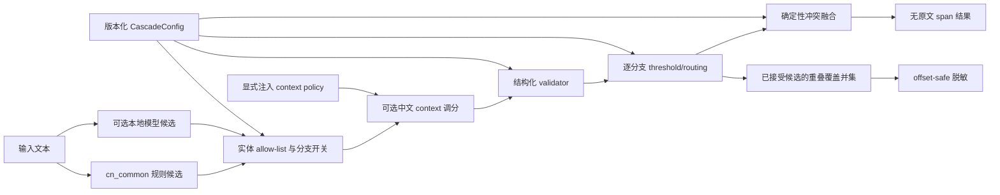

# 中文 PII 级联运行时架构

`CascadePipeline` 是 Python、CLI、Presidio、HTTP 和统一级联评测器共同调用的唯一检测运行时。
适配层可以改变输入/输出协议，但不得复制 context、validator、路由或融合逻辑。



## 三种显式模式

| 模式 | 规则分支 | 本地模型分支 | 主要用途 |
|---|---:|---:|---|
| `rules-only` | 开 | 关 | CPU/offline 基线和确定性结构化 PII |
| `model-only` | 关 | 开 | 模型可归因评测；仍执行发布路由与必要 validator |
| `cascade` | 开 | 开 | 完整级联系统 |

`rules-only` 构造和模块导入不会加载 Torch、Transformers 或 checkpoint。模型模式只接受已经存在的
本地目录；加载器固定 `local_files_only=True`、`trust_remote_code=False`，并验证 safetensors、训练
manifest 状态及文件哈希。

## 运行时安全不变量

- recognizer 输出视为不可信输入：未知标签、未请求标签和关闭的分支一律丢弃；
- offset 必须满足 `0 <= start < end <= len(text)`，越界结果使请求失败；
- 可选 context 只能返回新的有限 `[0, 1]` 分数和枚举决策，不能改变 label/offset；其异常或非法
  决策使整个请求以不含原文的通用错误失败；
- 固定候选接受顺序是 allow-list/分支开关 → context → structured validator → threshold/routing；抽取随后
  进入确定性 fusion，脱敏随后进入字符覆盖并集；
- 结构化模型候选只有在路由声明了可用 validator 且校验通过时才进入融合；
- 短 `PERSON`、`CN_ADDRESS`、`USERNAME` 使用更高的模型阈值；
- validator 在冲突融合前运行，避免错误候选先压掉正确候选后再被删除；
- 同边界结果折叠并保留所有 `sources`；输出顺序和冲突选择是确定性的；
- 抽取的标签/offset 仍由 fusion 选优；脱敏不复用已经丢弃重叠 loser 的抽取结果，而是合并所有已接受
  候选的相连重叠区间，确保嵌套和部分重叠覆盖完整；
- 同类型合并区间保留实体类型，异类型合并区间使用 `PII`；类型映射缺少 `PII` 且未提供安全默认值时
  fail closed，字符串 replacement 则统一用于每个合并区间；
- 自定义子类若改写 `detect()` 或内部批处理路径，基类 `redact()` 会 fail closed，要求子类显式实现并
  回归验证自己的完整覆盖脱敏；不会静默退回只替换 fusion 胜者的旧语义；
- 检测结果只含 offset、标签、分数、来源和决策轨迹，不含输入或命中值；
- recognizer/context/validator 异常转换为通用错误，不把异常里的原文向 CLI/HTTP 调用方回显。

默认不注入 context enhancer，因此既有 Python、CLI 和 HTTP 的 score、span 与决策轨迹保持不变。
显式注入时，轨迹只增加 `context:no_match`、`context:positive`、`context:negative` 或
`context:mixed`，不写入命中的上下文短语。Presidio 的全局 context hook 固定为 no-op；它不会在
pipeline fusion 后再次修改分数。

当前默认 profile 是保守的 `c1-conservative-v1`。它是工程默认值，不是在人类 hidden 集上校准出的
“最佳” profile；`balanced`、`high_precision`、`high_recall_redact` 只有在新 dev 数据上完成逐标签
校准并绑定证据后才能加入。

## 稳定检测 schema

每个 `CascadeDetection` 使用左闭右开 Python 字符 offset，并包含：

```json
{
  "schema_version": "pii-zh.cascade.detection.v1",
  "start": 5,
  "end": 21,
  "entity_type": "EMAIL_ADDRESS",
  "score": 0.92,
  "source": "rule:cn_common",
  "sources": ["rule:cn_common"],
    "decision_process": [
    "candidate:rule",
    "route:structured",
    "validator:passed",
    "threshold:passed",
    "fusion:single_source"
  ]
}
```

`redact()` 返回包含未命中原文的完整字符串，因此其结果仍必须按可能含 PII 的数据处理。检测或脱敏
都不是合规保证；部署方仍需访问控制、日志治理、人工复核和适用法规评估。

## 适配层与证据链

| 入口 | 适配职责 | 共享实现 |
|---|---|---|
| Python | `detect` / `detect_batch` / `redact` | `CascadePipeline` |
| CLI | stdin/参数与版本化 JSON | `CascadePipeline` |
| Presidio | `RecognizerResult` 转换；全局 context hook 为 no-op | `PiiZhCascadeRecognizer` 包装同一 pipeline |
| HTTP | 请求限制、超时、并发和无缓存响应 | 注入同一 pipeline |
| evaluator | canonical JSONL、指标和内容寻址 provenance | `CascadePipeline.detect_batch` |

任何 benchmark 若没有调用这条发布路径，只能标为诊断脚本，不能支持发布级系统声明。
Presidio 行当前只覆盖 AnalyzerEngine 检测适配，不代表 Presidio Anonymizer 已实现或验证
coverage-union；脱敏 parity 目前限于直接 Python、CLI 和 HTTP 的 `CascadePipeline.redact()` 路径。
