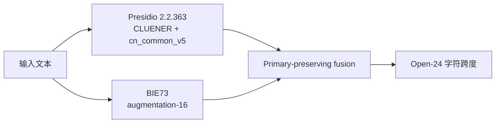

# BIE73 中文 PII 模型与 Presidio-primary 服务技术报告

## 摘要

BIE73 是一个约 0.6B 参数、面向简体中文的 24 类 PII token-classification 模型。它从固定
revision 的 `ZJUICSR/AIguard-pii-detection-fast` 初始化，将 Qwen3 token classifier 改为可使用
左右文的 full attention，并以 `O + 24 × B/I/E = 73` 个标签预测字符跨度。最终输出使用
constrained-Viterbi 解码，禁止非法的 B/I/E 状态转移。

本轮微调使用 88,000 条项目生成的 clean-room 合成文本，其中 72,000 条进入梯度训练，8,000 条
用于开发选择，8,000 条用于模型冻结后的一次性独立测试。没有加入真实 PII、客户数据、公开 NER
训练行或 PII Bench ZH 行。

最终产品服务不以 BIE73 替换成熟的 closed-8 检测链。服务以冻结的 native Presidio 2.2.363 +
CLUENER + `cn_common_v5` 为 primary，原样保留其 closed-8 输出；BIE73 只补充 Open-24 中另外
16 类。当前有完整的 closed-8 primary 指标，但尚无组合服务新的 Open-24 严格整体 F1。

## 1. 模型规格

| 项目 | 规格 |
|---|---|
| 初始化模型 | `ZJUICSR/AIguard-pii-detection-fast` |
| 初始化 revision | `677a5ebc1600fef61e8973cafd3026be322b3a73` |
| 架构 | `Qwen3BiForTokenClassification` |
| 层数 / hidden size | 28 / 1024 |
| attention heads / KV heads | 16 / 8 |
| 注意力 | padding-aware full attention，SDPA，不使用 causal mask |
| 参数量 | 616,384,658 |
| 可训练参数 | 20,259,913，约 3.29% |
| 标签协议 | BIE；`O + 24 × B/I/E = 73` |
| 解码 | constrained-Viterbi |
| 发布形态 | 合并后的单一 safetensors 权重，无运行时 LoRA adapter 依赖 |

full attention 是本版本的核心架构变化。中文 PII 的类型提示经常出现在值右侧，例如“这是病历号”
或“作为学号登记”。因果 token classifier 无法让前面的候选 token 使用这些右文；full attention
允许每个非 padding token 同时利用左右文。

初始化时，能够语义对应的源模型 BIE 分类头行被映射到 Core-24 标签，包括姓名、手机号、邮箱、
地址、生日、身份证、护照、驾驶证、社保号、银行卡、车牌和 secret。其余类别使用固定初始化。
随后在保持已加载 state-dict 数值不变的前提下，将 causal attention 转换为 full attention。

24 个输出实体类型为：

- `PERSON_NAME`, `PHONE_NUMBER`, `EMAIL_ADDRESS`, `ADDRESS`, `DATE_OF_BIRTH`；
- `CN_RESIDENT_ID`, `PASSPORT_NUMBER`, `DRIVER_LICENSE_NUMBER`, `SOCIAL_SECURITY_NUMBER`；
- `BANK_CARD_NUMBER`, `BANK_ACCOUNT_NUMBER`, `ALIPAY_ACCOUNT`；
- `VEHICLE_LICENSE_PLATE`, `EMPLOYEE_ID`, `STUDENT_ID`, `MEDICAL_RECORD_NUMBER`；
- `WECHAT_ID`, `QQ_NUMBER`, `USERNAME`, `IP_ADDRESS`, `MAC_ADDRESS`, `DEVICE_ID`；
- `GEO_COORDINATE`, `SECRET`。

`SECRET` 表示密码、token、密钥等敏感字符串，不一定属于法律定义中的个人信息。

## 2. 合成数据

### 2.1 数据规模

| split | 文档数 | 正样本 | PII-free hard negatives | counterfactual negatives | 是否进入梯度 |
|---|---:|---:|---:|---:|---:|
| train | 72,000 | 43,200 | 28,800 | 18,000 | 是 |
| dev | 8,000 | 4,800 | 3,200 | 2,000 | 否 |
| independent test | 8,000 | 4,800 | 3,200 | 2,000 | 否 |
| 合计 | 88,000 | 52,800 | 35,200 | 22,000 | 72,000 |

24 类在每个 split 内均衡：train 每类 2,025 个实体，dev 与 independent test 每类各 225 个。
所有实体值均由程序生成，并通过相应格式 validator；数据不包含真实个人信息。

### 2.2 生成来源

数据由仓库内编写的语法与实体值工厂生成，固定随机 seed 为 `20260722`。生成器覆盖 12 个应用域：
客服、电商、金融、医疗、教育、人力资源、政务、交通、即时通信、邮件/合同、研发运维和半结构化
表单。

正样本包含六种表达结构：

- 自然对话 25%；
- 自然叙述 25%；
- 自然流程 12.5%；
- 自然多实体 12.5%；
- 标签在前的结构化表达 12.5%；
- 值在前的结构化表达 12.5%。

生成维度还包括提示词在实体左侧、右侧或双侧，短/中/长文本，OCR/ASR 风格噪声，多种标点，
每类至少三套中文别名和四套 surface variants。

普通 hard negative 不包含目标 PII。counterfactual negative 则包含形式上类似身份证、账号、网络
标识等字符串，但上下文明确表示它属于机构、公共流程或非个人用途，gold span 为空。这类负例用于
降低“只看格式就报”的捷径学习。

### 2.3 Split 隔离

independent test 先生成并封存，随后才生成 train 和 dev。三个 split 使用独立的语法、模板与来源
namespace，并共享全局不重复的合成实体值流。

数据审计对每一对 split 检查七个维度：grammar group、template family、semantic skeleton、
entity value group、source group、text hash 和 document ID。七个维度的两两碰撞均为 0。

该隔离降低模板复制和实体值泄漏，但不能把合成独立测试等同于人工 hidden test 或真实业务文本。

## 3. 训练与模型选择

三个 seed 使用相同数据与固定训练配方，不根据前一个 seed 的结果修改后一个 seed。

| 超参数 | 设置 |
|---|---|
| seeds | `13 / 42 / 97` |
| epochs | 2 |
| max sequence length | 512 |
| train / eval device batch | 16 / 32 |
| gradient accumulation | 4；effective train batch 64 |
| optimizer / scheduler | AdamW / linear |
| LoRA rank / alpha / dropout | 32 / 64 / 0.05 |
| LoRA learning rate | `1e-5` |
| classifier learning rate | `5e-5` |
| weight decay / warmup ratio | `0.01 / 0.05` |
| precision | bf16 autocast；指标 logits 转 float32 |
| 其他 | gradient checkpointing；无 class weighting、resampling 或 label smoothing |

LoRA 覆盖 attention 与 MLP projection，分类头同时训练。三个 seed、两个 epoch 共形成六个可评测
checkpoint。选择先要求满足固定质量门槛，再比较 Closed-8 relevant micro/macro、Open-24 macro 和
PII-free document FPR。

最终选中 seed 42、epoch 1、global step 1125。LoRA checkpoint 合并后形成单一权重文件：

```text
model.safetensors SHA-256
cde3ab7366c5f733c13e58333429655ed84f0257f9ad5d8c716f2fc739ef4039
```

模型包中的 `training_manifest.json` 按训练完成时的字节原样保留，因此其中记录的代码包版本
`0.2.0rc1` 和训练期 `release_eligible=false` 表示当时尚未完成发布验收，不是当前 RC 的发布状态。
公开发布状态以 GitHub/Hugging Face 的 `v0.3.0rc1` tag、模型包 manifest 与对应哈希为准。

## 4. 单模型评测

所有 F1 均使用字符级 exact start/end/label 匹配。micro F1 汇总全部实体；macro F1 对标签等权；
PII-free document FPR 表示无 gold PII 的文档中至少输出一个 span 的比例。

### 4.1 合成独立与跨生成器回归

| 数据集 | 文档数 | strict micro F1 | strict macro F1 | PII-free document FPR |
|---|---:|---:|---:|---:|
| v7.2 independent test | 8,000 | 0.9520468 | 0.9563722 | 0.031250 |
| synthetic-v1.3 test | 2,000 | 0.7391763 | 0.7952115 | 0.253333 |

v7.2 independent 的 Open-24 micro/macro 与开发集接近。它的 Closed-8 relevant micro F1 为
`0.929286`，相对开发选择值下降 `0.030529`，略高于原定 `0.03` 稳定范围。synthetic-v1.3 的
结果进一步说明不同生成器和负例分布会显著影响误报率。

### 4.2 PII Bench ZH

PII Bench ZH 使用固定 revision、closed-8 标签、解码前标签 mask 和字符级 exact-span 评分。
Formal 有 5,000 个文档，Chat 有 3,000 个文档。

| split | strict micro F1 | strict macro F1 |
|---|---:|---:|
| Formal | 0.5465838509 | 0.5930315483 |
| Chat | 0.4749034749 | 0.4826017924 |
| Pooled | 0.5234460196 | 0.5660017265 |

该结果没有超过冻结的同协议模型包络，因此不支持“最佳单模型”或 SOTA 声明。PII Bench ZH 是
公开、程序化生成的 benchmark，且没有 PII-free 文档；它不能评估真实业务 FPR、完整 Open-24
能力或所有中文场景。

## 5. 产品服务：Presidio primary + BIE73 augmentation



### 5.1 Primary 分支

冻结 primary 为 native Presidio 2.2.363、固定 CLUENER checkpoint 和 `cn_common_v5`：

- CLUENER 模型：`uer/roberta-base-finetuned-cluener2020-chinese`；
- CLUENER revision：`cddd8fc233e373855a8c0a7f4b7eb83acb686a2b`；
- primary 独占八类：`ADDRESS`, `BANK_CARD_NUMBER`, `CN_RESIDENT_ID`, `EMAIL_ADDRESS`,
  `PASSPORT_NUMBER`, `PERSON_NAME`, `PHONE_NUMBER`, `VEHICLE_LICENSE_PLATE`。

CLUENER 权重不随本项目 Python 包或 BIE73 模型包分发。其上游模型卡未声明模型许可证，使用者需
自行下载到本地，并在使用或再分发前审阅上游材料与适用条款。

### 5.2 BIE73 augmentation-16

BIE73 在解码前屏蔽全部 closed-8 标签，只允许以下 16 类：

- `DATE_OF_BIRTH`, `DRIVER_LICENSE_NUMBER`, `SOCIAL_SECURITY_NUMBER`；
- `BANK_ACCOUNT_NUMBER`, `EMPLOYEE_ID`, `STUDENT_ID`, `MEDICAL_RECORD_NUMBER`；
- `WECHAT_ID`, `QQ_NUMBER`, `ALIPAY_ACCOUNT`, `USERNAME`；
- `IP_ADDRESS`, `MAC_ADDRESS`, `DEVICE_ID`, `GEO_COORDINATE`, `SECRET`。

组合 pipeline 原样返回 primary detections；当两个分支发生跨类型 overlap 时，primary 获胜。
因此 BIE73 不会改变 closed-8 的预测集合，组合服务的 closed-8 投影由代码合同保证与 primary 分支
完全相同。

### 5.3 冻结 closed-8 primary 结果

| split | strict micro F1 | strict macro F1 |
|---|---:|---:|
| Formal | 0.9527327902 | 0.8732108951 |
| Chat | 0.9361379310 | 0.8399701577 |
| Pooled | 0.9473637236 | 0.8667338443 |

这些数字是冻结 primary 分支的实测结果。虽然组合服务的 closed-8 投影按代码合同相同，
`0.9473637236` 仍不能称为整套 Open-24 服务 F1。Open-24 增强服务尚无新的严格整体 F1，因此
本文不声称组合服务严格超过该基线或达到 SOTA。

## 6. 跨数据集服务回归

| 检查 | 当前结果 | 对照 | 解释 |
|---|---:|---:|---|
| CLUENER legacy compatibility strict micro F1 | 0.794555（5020/6318） | 第一版 0.786972（5050/6417） | PASS |
| CrossWOZ emission guard | 2 emitting docs / 2 spans | 8 / 8 | PASS |

CLUENER 检查验证历史 Presidio/中文 NER compatibility 分支，BIE73 不参与，不能把 `0.794555`
归因于新模型。CrossWOZ 当前没有 span-level gold，只能证明候选没有比对照产生更多 emitting docs
和 spans，不能报告 F1，也不能证明召回率。

## 7. 可复现使用边界

- 单模型跨度必须使用项目的 `load_full_bie73_predictor` 和 constrained-Viterbi；通用
  `transformers.pipeline(..., aggregation_strategy="simple")` 不实现合法 BIE 路径约束。
- 产品 profile 为 `community-presidio-bie73-cascade-v1`，同时需要本地 BIE73 目录与固定
  CLUENER 目录。
- CLI 分别使用 `--model-path` 与 `--primary-model-path`；HTTP/Python 分别使用 `model_path` 与
  `primary_model_path`。
- 模型和 primary 权重均应固定 revision；服务不会自动下载或静默退回另一种模式。

## 8. 局限

- 88,000 条本轮数据全部为合成数据。它们可审计且不含真实 PII，但不能完整覆盖真实语言、行业
  缩写、OCR/ASR 噪声与分布漂移。
- “微调数据全部合成”不代表全部模型知识来自合成数据；BIE73 继承 AIguard 与 Qwen3 backbone
  的上游权重。
- 单模型在不同合成生成器上的 FPR 差异明显，正式使用前需要目标域评测和人工抽检。
- PII Bench ZH 是公开 closed-8 benchmark，已暴露且没有 PII-free 文档，不能支持真实世界或
  Open-24 全局排名。
- Presidio primary 的 closed-8 指标不能外推为 Open-24 组合服务指标；augmentation-16 尚缺新的
  严格整体 F1。
- CLUENER 上游模型卡未声明模型许可证，其权重不由本项目分发。
- CrossWOZ 回归没有 gold，只是误报 emission guard。
- 检测结果是候选跨度，不判断标识是否真实签发、属于某人或必须依法脱敏。

## 结论

BIE73 提供了一个可本地运行、覆盖 24 类、使用 full attention 与 constrained-Viterbi 的中文 PII
模型。其合成独立集表现较好，但最终 PII Bench ZH 单模型结果并不领先。项目据此采用更务实的
产品结构：以冻结 Presidio closed-8 能力为 primary，严格保留其输出，再由 BIE73 补充另外 16 类。
当前证据支持该职责划分与 closed-8 投影一致性；Open-24 组合质量仍需后续严格评测。
